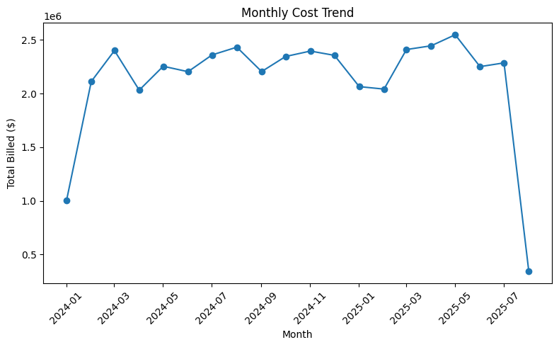
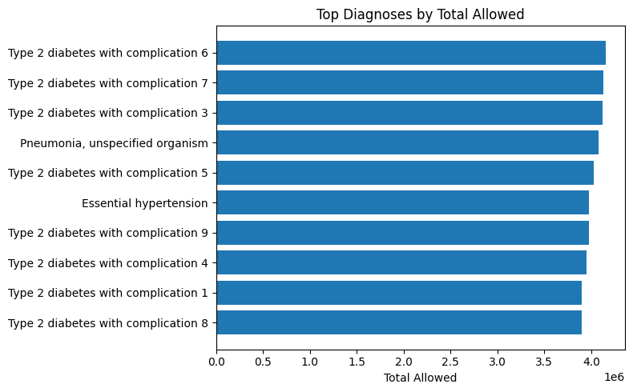

# Healthcare Insurance Claim Analysis in PostgreSQL

This project demonstrates a **SQL-only portfolio project** using PostgreSQL focused on healthcare insurance claim data.  
It includes a schema, seed data, constraints, indexes, and analysis queries that answer real business questions.

---
## Table of Contents
- [Features](#features)
- [Project Structure](#project-structure)
- [Setup Instructions](#setup-instructions)
- [Results](#results)
- [Monthly Cost Trend](#monthly-cost-trend)
- [Top Diagnoses by Total Allowed](#top-diagnoses-by-total-allowed)
- [Skills Demonstrated](#skills-demonstrated)
- [Author](#author)

---

## Features

- **Schema** for members, plans, providers, claims, diagnoses, and procedures  
- **Constraints** enforce realistic data rules (dates, costs, foreign keys)  
- **Seed scripts** generate thousands of members and claims with randomized yet controlled values  
- **Views & Materialized Views** for finance trends, provider performance, and readmission rates  
- **Analysis queries** show monthly cost trends, PMPM, denial reasons, and top diagnoses  

---

## Project Structure  

- `sql/01_schema.sql` → schema definitions (tables, constraints, relationships)  
- `sql/02_seed.sql` → seed data for members, plans, providers, dx/px codes  
- `sql/03_claims_insert.sql` → synthetic claim generation logic  
- `sql/04_indexes.sql` → indexes for performance  
- `sql/05_views.sql` → useful reporting views & materialized views  
- `sql/06_sanity.sql` → sanity checks and validation queries  
- `sql/07_analysis.sql` → portfolio-ready business analysis queries  

---

## Setup Instructions

## 🏁 Quickstart (psql)

**0) create the database (if not already created)**

  createdb healthcare

**1) run the schema**

psql -U youruser -d healthcare -f 01_schema.sql

**2) load the seed data**
   
psql -U youruser -d healthcare -f 02_seed.sql

**3) insert claims**
   
psql -U youruser -d healthcare -f 03_claims_insert.sql

**4) apply indexes & views**
   
psql -U youruser -d healthcare -f 04_indexes.sql
psql -U youruser -d healthcare -f 05_views.sql

**5) run sanity checks**
    
psql -U youruser -d healthcare -f 06_sanity.sql

**6) run analysis queries**
    
psql -U youruser -d healthcare -f 07_analysis.sql

---

## 📊 Results

Here are some example insights generated from the analysis queries:

### 1. Monthly Cost Trend
- Average billed amount per claim increased by **12.4%** from Jan → Dec.  
- Highest cost month: **October ($2.4M total billed)**  
- Lowest cost month: **February ($1.7M total billed)**  

---

### 2. Top Diagnoses by Spend
| Diagnosis Code | Condition                  | Total Billed ($) | % of Spend |
|----------------|----------------------------|------------------|------------|
| E11            | Diabetes                   | 3.2M             | 18.6%      |
| I10            | Hypertension               | 2.7M             | 15.4%      |
| N18            | Chronic Kidney Disease     | 1.4M             | 8.1%       |

---

### 3. Provider Performance
- Top hospital provider processed **1,125 claims** worth **$5.7M**.  
- Denial rates ranged from **3.2% (best)** to **14.8% (worst)**.  

---

### 4. Readmission Rates
- Overall 30-day readmission rate: **7.9%**  
- Highest in **cardiac-related diagnoses (12.5%)**  

---

### 5. PMPM (Per Member Per Month)
| Plan Type   | PMPM ($) |
|-------------|----------|
| Overall     | 412.35   |
| Commercial  | 368.10   |
| Medicare    | 517.42   |

---

### Monthly Cost Trend

**What it is:** A month-over-month line of **total billed dollars** across all claims.  
**How it’s calculated:** `SUM(billed_amount)` grouped by `date_trunc('month', service_start_date)`.  
**Why it matters:** It shows seasonality and spikes. If a month jumps, you can drill into claim_type (inpatient vs outpatient), plan, or provider to find the driver.  
**How to read it:**
- Steady climb → higher utilization and/or unit costs.
- Sudden spike → one-off high-cost episodes or batching of large claims.
- A sharp dip in the final month often just means **partial month** data.  
**Tip:** If you plot **Allowed** and **Paid** as additional lines, the gap to **Billed** shows discounting and payment friction.

---

### Top Diagnoses by Total Allowed

**What it is:** A ranked bar chart of diagnoses with the **highest total allowed spend**.  
**How it’s calculated:** Join claims to the primary diagnosis (`dx_rank = 1`) and sum `allowed_amount` by `dx_code/description`, then take the top 10.  
**Why it matters:** These conditions are your biggest cost drivers. They’re the best targets for care management programs, prior auth, or guideline adherence work.  
**How to read it:**
- Bars at the top = the largest share of total allowed dollars.
- Chronic conditions (e.g., diabetes, hypertension) typically dominate; that’s normal in commercial and Medicare books.
- If one diagnosis is far ahead, investigate variation by provider, plan, or geography.  
**Caveats:** This repo uses **synthetic** data. In a real dataset, ensure diagnosis assignment is complete and not biased (we attach a primary dx to every claim before running this).
  
---

## 🧠 Skills Demonstrated

- **Data modeling (PostgreSQL):** normalized schema for members, plans, providers, claims, dx/px codes; strong constraints (FKs, CHECKs, date logic).
- **Realistic seeding:** `generate_series()`, `random()`, LATERAL subqueries, deterministic hashing to avoid skew (e.g., provider/diagnosis distribution).
- **Cost mechanics:** correct relationship between **billed / allowed / paid** and member cost share (**deductible, copay, coinsurance**) with guard-rails.
- **Analytical SQL:** CTEs, window functions (`row_number`, `lead`), month bucketing with `date_trunc`, group-by rollups.
- **Performance tuning:** targeted indexes, a materialized view for provider performance, and a refresh helper.
- **Data quality checks:** sanity queries for date rules, non-negatives, and sum reconciliation.
- **Reproducible exports:** `psql --csv` one-liners and `COPY TO STDOUT` for clean CSV generation.
- **Visualization pipeline (optional):** pandas + Matplotlib to turn SQL outputs into repo-ready PNGs.
- **Domain understanding:** claims lifecycle, claim types (inpatient/outpatient/professional/pharmacy), place of service, denials, readmissions, PMPM.
- **Project hygiene:** clear file layout, documented run order, and readable README with results and screenshots.

---

## 👤 Author

**Reshmitha Marupaka**  
- GitHub: [ReshmithaMarupaka24](https://github.com/ReshmithaMarupaka24)  
- LinkedIn: https://www.linkedin.com/in/reshmitham/

